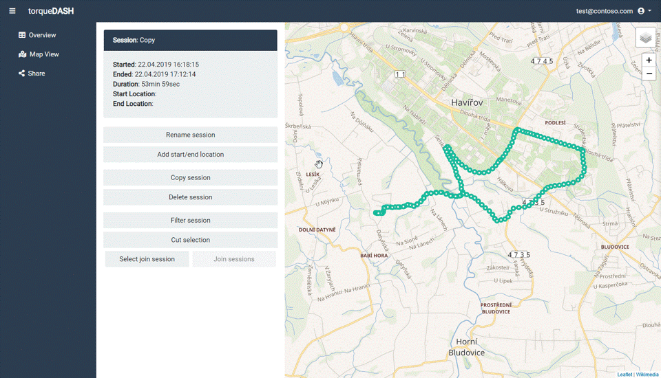
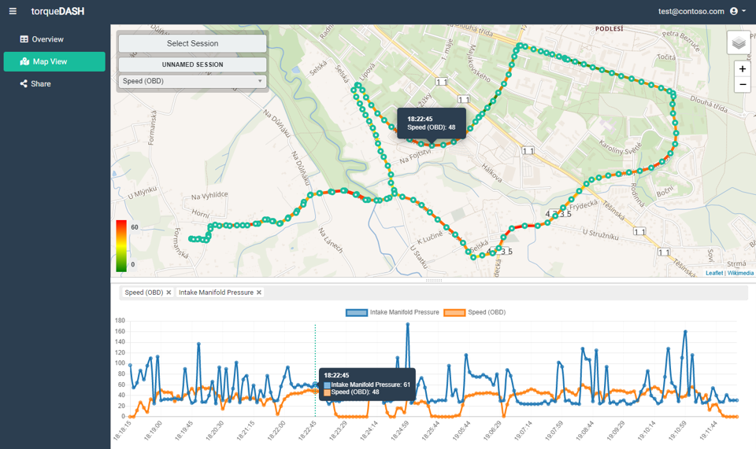
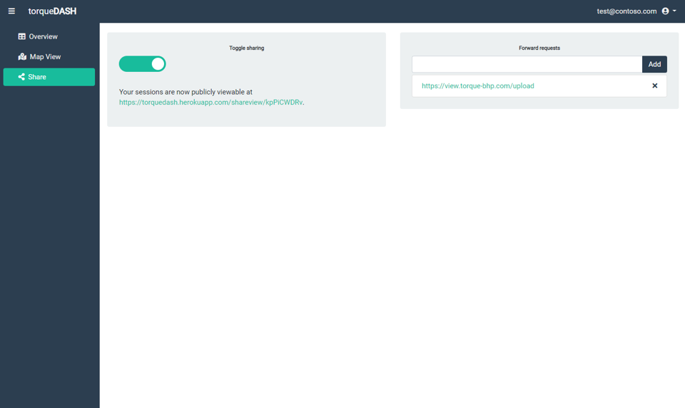

<!-- PROJECT LOGO -->
<br />
<p align="left">
    
  <p align="left">
    A web application for uploading and presenting real-time diagnostic automobile data (OBD2) logged by Torque android app.
  </p>
  <p align="left">
    <strong>✨ NEW in v2.0:</strong> Custom real-time dashboards with drag-and-drop editor and OBS/streaming support!
  </p>
</p>


<!-- TABLE OF CONTENTS -->
## Table of Contents

* [About the Project](#about-the-project)
  * [Built With](#built-with)
  * [What's New in v2.0](#whats-new-in-v20)
* [Getting Started](#getting-started)
  * [Installation](#installation)
  * [Logging Data](#logging-data)
* [Functionality](#functionality)
* [Custom Dashboards](#custom-dashboards)
* [Upgrading](#upgrading)
* [License](#license)


<!-- ABOUT THE PROJECT -->
## About The Project

This project aims to provide a web application capable of receiving, editing and presenting OBD2 automobile data logged by the [Torque Pro](https://play.google.com/store/apps/details?id=org.prowl.torque&hl=en) android application. This provides an open source alternative to the official Torque Web Viewer.

### Built With
This project was built with the help of

* [Bootstrap](https://getbootstrap.com) - responsive frontend framework
* [JQuery](https://jquery.com) - javascript library used for DOM manipulation and Ajax
* [Node.js](https://nodejs.org) - javascript runtime
* [Express.js](https://expressjs.com) - web framework for Node.js
* [Sequelize.js](http://docs.sequelizejs.com/) - Node.js ORM for relational databases 
* [Leaflet.js](https://leafletjs.com/) - javascript library for interactive maps
* [Chart.js](https://www.chartjs.org/) - javascript charting library
* [Socket.IO](https://socket.io/) - real-time bidirectional communication
* ...

### What's New in v2.0

🎉 **Major update with custom dashboard builder!**

* ✨ **Custom Dashboards** - Create fully customizable real-time dashboards
* 🎨 **Visual Editor** - Drag-and-drop widget editor
* 📊 **Widget Library** - 6 types of gauges and displays (speedometer, tachometer, temperature, etc.)
* 🔄 **Real-time Updates** - WebSocket-based live data streaming
* 🎥 **Browser Source** - OBS/streaming integration with transparent background
* 🌐 **Public Sharing** - Share dashboards with public links
* 📦 **Updated Dependencies** - All libraries updated to latest versions (2025)

See [DASHBOARD_GUIDE.md](DASHBOARD_GUIDE.md) for detailed documentation.


<!-- GETTING STARTED -->
## Getting Started

To get started using the application you first need a hosting server and postgres database. To try out the app for free, I recommend using a [Heroku Free](https://www.heroku.com/free) Tier account.

### Installation
#### With Heroku

1. Create a fork of the repo.
2. Create a new app in Heroku with a postgres addon
3. Enable GitHub integration for deployment and connect the forked repo to your app ([More info](https://devcenter.heroku.com/articles/github-integration))
4. Deploy the application from heroku.

#### Local / Ubuntu Linux

**Quick start:**
1. Clone the repo
```sh
git clone https://github.com/davekrejci/torque-dash.git
```
2. Install NPM packages
```sh
npm install
```
3. Configure your database connection URI either in your environment variables or in `config.js`
```JS
uri: process.env.DATABASE_URL || 'your connection URI'
```
4. Create uploads directory
```sh
mkdir -p public/uploads
```
5. Start the server
```sh
npm start
```

**Detailed Ubuntu installation guide:** See [INSTALL_UBUNTU.md](INSTALL_UBUNTU.md) for complete step-by-step instructions including PostgreSQL setup, systemd service, Nginx configuration, and SSL.

### Logging data

To be able to log data from Torque Pro:

1. Register an account in torqueDASH
2. In Torque Pro settings set the user email address to the same as your accounts.
3. In Torque Pro settings set the Webserver URL to the */api/upload* path
```
https://yourappname.herokuapp.com/api/upload
```

<!-- Functionality -->
## Functionality

### Overview

A filterable table with a list of all logged sessions and options to edit, delete and export session data to CSV.

### Editing

Editing page for sessions with functionality for 

1. renaming
2. adding start/end locations (geocoding option)
3. copying and deleting
4. filtering number of datapoints
5. cutting out parts of the session
6. merging multiple sessions together



### Mapview

Provides a graphical representation of the logged ride on top of a map with a heatline for selected PIDs and a line chart beneath the map for charting PID values. Also displays "live" data if watching a currently ongoing session.



### Share

Provides options for sharing logged data.

1. Sharing with public URL - creates a public URL which provides access to a mapview of your logged sessions
2. Request forwarding - You may list other server URLs to which the data sent from Torque Pro will be further forwarded (eg. official Torque Web Viewer)



### Custom Dashboards (NEW!)

Create beautiful, customizable dashboards with real-time data visualization.

**Widget Types:**
* 🎛️ **Speedometer** - Circular speed gauge
* 🎛️ **Tachometer** - RPM gauge with warning zones
* 📊 **Circular Gauge** - Universal circular indicator
* 📊 **Linear Gauge** - Horizontal/vertical bar gauge
* 🌡️ **Temperature** - Vertical thermometer display
* 🔢 **Digital Display** - Large digital readout with glow
* 💡 **Indicator Light** - Warning lights/indicators with blinking ✨NEW

**Customization Features:**
* 🎨 **Colors, ranges, labels, units** - Full styling control
* 📡 **Sensor Mapping** - Link widgets to specific OBD2 PIDs
* 🖼️ **Custom Images** - Background/foreground images with opacity ✨NEW
* 🎬 **Smooth Animations** - Value smoothing and update delays ✨NEW
* ⚡ **Conditional Triggers** - Indicators based on thresholds/ranges ✨NEW
* ✨ **Blink Animations** - Steady, blink, fast-blink, pulse patterns ✨NEW

**Advanced Features:**
* **Image Modes:**
  - Single image as semi-transparent background
  - Dual images (background + filling foreground)
  - Custom opacity control
* **Animation:**
  - Smoothing (0-1): smooth value transitions
  - Update Delay: delayed updates in milliseconds
  - Blink patterns for indicators
* **Indicator Lights:**
  - Multiple shapes (circle, square, triangle, custom icon)
  - Conditional activation (threshold, range, always)
  - Customizable colors and glow effects
  - Animation patterns (blink, pulse)

**How to use:**
1. Go to **Dashboards** section
2. Create new dashboard
3. Add widgets from the palette
4. Configure each widget (sensor, colors, ranges, images)
5. Set up smoothing and animations
6. Add indicator lights for warnings
7. Connect to live session for real-time data
8. Share publicly for OBS/streaming use

**Guides:**
* [DASHBOARD_GUIDE.md](DASHBOARD_GUIDE.md) - Complete dashboard guide
* [ADVANCED_FEATURES.md](ADVANCED_FEATURES.md) - Images, smoothing, indicators
* [IMAGE_UPLOAD_GUIDE.md](IMAGE_UPLOAD_GUIDE.md) - Image upload to server ✨NEW
* [USER_SETTINGS_GUIDE.md](USER_SETTINGS_GUIDE.md) - User settings (Live Mode toggle) ✨NEW
* [LIVE_ONLY_MODE.md](LIVE_ONLY_MODE.md) - Technical Live-Only mode docs
* [EXAMPLES.md](EXAMPLES.md) - Configuration examples
* [NEW_FEATURES_v2.1.md](NEW_FEATURES_v2.1.md) - v2.1 overview

<!-- UPGRADING -->
## Upgrading

If you're upgrading from v1.x to v2.0, please read [UPGRADE_INSTRUCTIONS.md](UPGRADE_INSTRUCTIONS.md) for detailed upgrade steps and migration guide.

**Quick upgrade:**
```bash
# Backup database
pg_dump your_database > backup.sql

# Update code
git pull origin master

# Update dependencies
rm -rf node_modules package-lock.json
npm install

# Create uploads directory
mkdir -p public/uploads

# Restart server
npm start
```

---

## 🚀 New in v2.1

### Image Upload
Upload images directly to server instead of using external URLs:
- **Upload button** in dashboard editor
- **Image gallery** to browse uploaded images
- **5MB file size** limit
- **Auto-naming** and organization

See [IMAGE_UPLOAD_GUIDE.md](IMAGE_UPLOAD_GUIDE.md)

### Live-Only Mode
Stream sensor data in real-time WITHOUT saving logs to database.

**⭐ NEW: User Settings!**
Each user can now toggle Live-Only mode individually via web interface:
- Navigate to **Settings** in sidebar
- Toggle **Live-Only Mode** switch
- Changes apply instantly
- No server restart needed

**Features:**
- **Per-user control** - each user decides ✨NEW
- **Global override** - admin can force for all users
- **PostgreSQL REQUIRED** - for auth & dashboards
- **Authentication WORKS** - users login normally
- **Dashboards SAVED** - configuration persists
- **Sensor logs NOT saved** - only real-time streaming
- **In-memory cache** - last data kept for 5 minutes

**Perfect for:**
- 🎥 OBS/streaming overlays
- 💾 Saving database space
- 🧪 Testing without data accumulation
- 🔒 Privacy (no history saved)

**Documentation:**
- [USER_SETTINGS_GUIDE.md](USER_SETTINGS_GUIDE.md) - How to use Settings page ✨NEW
- [LIVE_ONLY_MODE.md](LIVE_ONLY_MODE.md) - Technical details

<!-- LICENSE -->
## License

Distributed under the MIT License. See `LICENSE` for more information.
